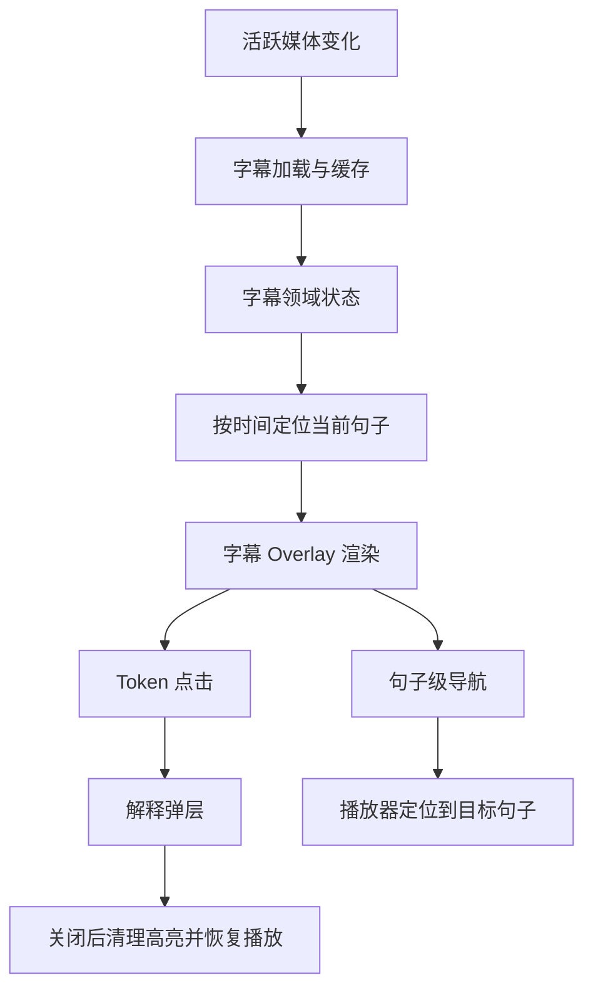

# 可点击字幕 Overlay 系统设计与实现文档

## 1. 文档目标

本文档描述一套适用于内容型学习应用的可点击字幕 Overlay 系统。目标不是约束某个具体工程的文件结构或库选型，而是沉淀一套可复用的需求定义、分层思路、状态模型、交互闭环和实现取舍，供其他项目直接参考、裁剪或重建。

这套系统面向的典型场景是：用户在观看视频时，一边消费内容，一边通过字幕进行理解、停顿、查词、短语解释和句子导航，把“播放体验”和“学习体验”合成一个统一交互层。

## 2. 一句话定义

可点击字幕 Overlay 系统，本质上是一个覆盖在媒体播放层之上的轻交互学习层：它基于当前播放时间定位字幕句子，以 token 级别提供解释能力，并与播放器控制、句子导航、词汇沉淀和弹层系统协同工作。

## 3. 设计目标

### 3.1 业务目标

- 让字幕不只是被动展示文本，而是成为可操作的学习入口
- 让用户在不中断观看主流程的前提下完成查词和理解补充
- 让句子跳转、字幕显示、翻译显示和解释弹层形成连贯体验
- 让学习结果可以进一步沉淀到词汇、短语或知识条目体系中

### 3.2 交互目标

- 字幕应该始终跟随当前播放位置稳定更新
- 用户点击可解释 token 时，系统应迅速给出反馈并进入解释态
- 解释态结束后，系统应恢复到可预测的观看状态
- 导航操作应以“句子”为单位，而不是粗糙地按固定秒数跳转

### 3.3 工程目标

- 让字幕数据、字幕交互和播放器 Overlay 彼此解耦
- 只让当前活跃媒体承担完整字幕交互成本，避免多实例并发开销
- 在高频播放时间更新下保持渲染和查询成本可控
- 允许后续扩展到多语言、短语高亮、知识沉淀和多模态解释

## 4. 适用范围与非目标

### 4.1 适用范围

这套设计适合以下产品形态：

- 短视频学习应用
- 课程视频播放器
- 带字幕的音视频学习产品
- 需要词汇解释、短语解释或句子导航的内容型应用

### 4.2 当前版本的边界选择

为了优先保证交互质量和性能，当前版本适合采用以下边界：

- 仅在沉浸式播放态启用完整的可点击字幕能力
- 仅对当前活跃媒体实例启用字幕查询与交互
- token 点击默认打开解释弹层，而不是直接跳转播放位置
- 句子导航优先通过播放器手势或辅助控件触发
- 小窗、列表态或嵌入态可以保留字幕挂载位，但默认不启用完整交互

### 4.3 非目标

- 不覆盖逐字稿编辑器
- 不覆盖完整的笔记系统和复习算法
- 不默认支持多媒体实例同时独立拥有一套字幕交互状态
- 不要求字幕点击直接承担播放器全部导航职责

## 5. 核心概念

### 5.1 活跃媒体

指当前真正处于交互焦点的媒体实例。整个字幕系统只围绕一个活跃媒体运转，包括：

- 当前播放时间
- 当前对应字幕
- 当前句子定位
- 当前 token 解释状态

### 5.2 句子

句子是字幕系统的时间级单位，至少应包含：

- 全局顺序编号
- 开始时间
- 结束时间
- 原文文本
- 句子级解释或翻译
- token 列表

### 5.3 Token

token 是字幕中的最小可交互单位，通常是单词、短语切分结果或标点。可点击 token 通常需要具备：

- 文本内容
- 可选解释文本
- 可选语义元素信息
- 所属句子上下文

### 5.4 语义元素

语义元素是高于表面 token 的业务单元，用于表达：

- 这个 token 属于哪个词或短语
- 它的词性、标签、中文短义、详细释义是什么
- 多个表面 token 是否属于同一个短语实体

这使系统可以按“语义单元”高亮，而不是只按渲染出来的单个片段高亮。

### 5.5 Token Key

token key 是字幕交互状态的唯一标识，建议优先基于语义元素标识生成；若没有语义元素，再退回到“句子编号 + token 顺序”的组合键。这样可以让多 token 短语共享统一的解释和高亮身份。

### 5.6 Modal 高亮态

当用户点击某个 token 并进入解释弹层时，字幕层应保留一个“当前弹层对应 token”的高亮状态，用于：

- 在弹层打开期间给用户明确视觉反馈
- 在弹层关闭后恢复到干净状态
- 与普通选中态区分优先级

### 5.7 句子导航态

句子导航不是简单地“下一句”或“上一句”按钮，而是一种临时状态机。它需要记住用户刚刚导航到的句子位置，在短时间内支持连续前后跳，而不是每次都重新从当前播放时间做全量判断。

## 6. 分层架构

建议把这套系统拆成四层。

### 6.1 数据获取与预处理层

负责：

- 监听活跃媒体切换
- 拉取字幕数据
- 命中缓存或发起加载
- 统一解析和归一化不同字幕格式
- 做时间优化、空白段补齐和重新编号

这一层只关心“把一份可查询的字幕数据准备好”，不关心具体 UI。

### 6.2 字幕领域层

负责：

- 存储当前字幕和已缓存字幕
- 维护活跃媒体对应的字幕指针
- 按时间查询当前句子
- 提供上一句、下一句等句子级辅助能力
- 提供字幕已加载、是否可用等状态

这一层应该是纯数据层，不直接依赖具体播放器布局或弹层样式。

### 6.3 字幕交互层

负责：

- 根据当前播放时间计算当前句子
- 决定哪些 token 可点击
- 管理 modal 高亮态
- 触发解释弹层
- 在必要时暂停和恢复播放
- 组合当前句子、当前高亮态、导航动作等交互状态

这一层是字幕系统的核心逻辑层。

### 6.4 播放器 Overlay 组合层

负责：

- 把字幕层挂到播放器之上
- 与视频控制层并列放置，而不是互相嵌套耦合
- 协调点击、单击、双击、长按等手势
- 只在活跃媒体实例上启用完整字幕交互
- 根据小屏、全屏、横屏、竖屏决定是否启用和如何布局

## 7. 推荐的系统关系

## 8. 数据模型设计

### 8.1 字幕对象

建议字幕对象采用扁平句子数组，而不是让 UI 在运行时去遍历复杂段落结构。一个适合交互系统的字幕对象应包含：

- 总句子数
- 总 token 数
- 按时间排序的句子数组

### 8.2 句子对象

句子对象应至少具备：

- `index`
- `start`
- `end`
- `text`
- `explanation`
- `tokens`

如果后续需要支持学习进度、句子收藏或批注，也可以继续向句子对象扩展，但不建议一开始就把 UI 状态混进去。

### 8.3 Token 对象

token 对象建议包含：

- `index`
- `text`
- `explanation`
- `semanticElement`
- 可选的 `start/end`

这里最重要的是解释信息和语义元素，而不是过早加入展示用样式字段。

### 8.4 空白句子

如果句子之间存在明显间隔，建议在预处理阶段主动插入空白句子。这样系统可以明确地区分：

- 当前确实有字幕内容
- 当前处于两句之间的静默区间

同时，句子导航层可以明确跳过这些空白句子，而不是在 UI 层做模糊判断。

## 9. 数据预处理策略

一个成熟的可点击字幕系统，不应把接口原始返回值直接拿来渲染。建议预处理包含以下步骤：

### 9.1 格式归一化

统一把不同来源的字幕数据变成同一套句子结构。

### 9.2 时间排序

无论上游是否保证顺序，落到客户端领域层前都应按开始时间重新排序。

### 9.3 时间提前显示

为了减少“字幕出现略晚于语音”的体感，建议把句子显示开始时间做轻微提前，但必须避免与前一句产生重叠。

### 9.4 空白段补齐

在相邻句子之间存在明显时间间隔时，插入空白句子作为导航和显示边界。

### 9.5 顺序重编号

所有句子在完成排序和补齐后，都应重新生成连续编号，避免后续查找逻辑混乱。

## 10. 状态模型

建议把状态分成三个层面。

### 10.1 全局字幕状态

这部分属于领域层：

- 当前活跃字幕
- 当前活跃媒体标识
- 已缓存字幕集合
- 当前句子索引指针
- 加载状态
- 加载中的媒体标识

### 10.2 字幕交互局部状态

这部分属于字幕交互层：

- 当前句子
- 是否有上一句和下一句
- 已选中 token 集合
- 当前弹层高亮 token
- 当前版本的交互配置

### 10.3 播放器 UI 状态

这部分属于播放器控制层：

- 是否显示字幕
- 是否显示翻译
- 控件是否显示
- 当前是否全屏
- 当前是否活跃媒体

字幕系统应消费这些状态，但不应接管它们的全部来源。

## 11. 当前版本的真实交互闭环

### 11.1 当前句子跟随

系统持续读取活跃播放器的当前播放时间，并将其映射到当前句子。这个过程是高频行为，必须走轻量查询路径。

### 11.2 Token 点击查词

推荐的真实交互闭环是：

1. 用户点击带解释信息的 token
2. 系统立刻给出轻触反馈
3. 若播放器原本正在播放，则先暂停播放
4. 系统记录当前 token 的高亮态
5. 打开解释弹层
6. 用户在弹层中查看词义、短义、详细释义和扩展操作
7. 弹层关闭后，清理高亮态
8. 如果弹层打开前视频在播放，则恢复播放

这个闭环的优点是：

- 学习动作有明确开始和结束
- 不会让用户在弹层期间丢失上下文
- 关闭弹层后能自然回到观看流程

### 11.3 句子导航

推荐把句子导航放在播放器手势层或辅助控件层，而不是把“点 token”和“句子跳转”混成一个动作。

常见做法是：

- 双击左侧：上一句
- 双击右侧：下一句
- 当用户已经播放到当前句子较后位置时，第一次“上一句”先回到本句开头
- 在短时间内连续导航时，按上次导航位置继续跳，而不是每次重新从当前时间推导

### 11.4 翻译显示

句子级翻译可以作为字幕正文的补充层，与 token 点击解释互补：

- 正文负责帮助用户跟住原语
- 翻译负责帮助用户快速理解整句语义
- token 点击负责解决局部难点

### 11.5 当前版本已落地能力与预留扩展面

为了避免设计面和实现面混淆，建议明确区分以下两类内容。

当前版本已落地的核心能力：

- 活跃媒体切换后自动加载并激活字幕
- 基于当前播放时间定位当前句子
- 在沉浸式播放态展示原文字幕与句子级翻译
- 点击可解释 token 进入解释弹层
- 弹层打开期间维持 token 高亮，并在关闭后清理
- 弹层打开前若媒体处于播放中，关闭后恢复播放
- 通过背景手势执行句子级前进和后退

当前版本保留但未完全兑现的扩展面：

- 普通 token 选中态
- 独立的上一句、下一句导航控件
- token 点击直接驱动播放跳转
- 小窗或列表态下的完整可点击字幕能力
- 更强的自动滚动和句子列表联动

这种分层表达非常重要。对外写文档时，必须把“当前系统真的在做什么”和“接口层为未来保留了什么”分开，否则复用方会高估系统成熟度。

## 12. 查询与导航算法

### 12.1 当前句子定位

推荐采用三段式查询策略：

1. 先检查当前索引指针对应的句子
2. 若不匹配，则在附近做少量局部线性搜索
3. 再回退到二分搜索

这样在顺序播放时，查询通常接近常数时间；只有跳跃播放或大跨度 seek 时才进入对数复杂度。

### 12.2 指针回写

当系统找到新的句子位置后，不建议在渲染期直接同步回写状态。更稳妥的做法是：

- 先本地缓存新的索引结果
- 以轻量异步方式回写全局索引
- 对高频回写做节流或防抖

### 12.3 连续导航上下文

句子导航建议维护一个短生命周期的“最近导航索引”。它可以解决两个问题：

- 连续多次上一句/下一句时，不受播放时间微小变化干扰
- 用户在短时间内快速前后跳句子时，体验更稳定

### 12.4 空白句跳过

导航逻辑应明确跳过空白句子，否则用户会感觉导航失灵或无意义停顿过多。

## 13. 渲染与布局策略

### 13.1 Overlay 放置方式

建议把字幕层和控制层都作为播放器之上的 Overlay，同级组合，而不是让字幕成为控制栏内部的一个子部件。这样有几个好处：

- 字幕层可以独立布局
- 控制层和字幕层的演化边界清晰
- 手势命中与文本点击更容易分离

### 13.2 命中策略

字幕容器推荐采用“空白区域不拦截事件，只有文本片段可点击”的策略。这样可以保证：

- 点击字幕 token 触发解释
- 点击非字幕区域仍能触发播放器手势
- 背景层的播放/导航手势不会被字幕大面积吞掉

### 13.3 显示位置

沉浸式播放态推荐默认放在底部偏上的安全位置，理由是：

- 更接近用户视线焦点
- 不容易遮挡顶部返回或状态信息
- 与竖屏短视频产品习惯一致

### 13.4 小窗模式

小窗或列表播放态通常不适合启用完整字幕交互，原因包括：

- 点击区域太小
- 与滚动手势冲突高
- 词义弹层会打断列表消费
- 性能收益低于交互成本

因此，小窗模式更适合保留挂载位，但默认关闭完整可点击能力。

## 14. 视觉与反馈设计

### 14.1 文本层级

建议至少提供两层文本：

- 主字幕：原文
- 辅助译文：句子级解释或翻译

两层文本应通过字号、透明度和行高区分，而不是用截然不同的排版系统。

### 14.2 点击反馈

token 点击建议同时具备：

- 触觉反馈
- 颜色高亮
- 弹层出现

这三者叠加后，用户才能清楚知道“我点中了什么、系统接受了什么、现在处于什么状态”。

### 14.3 高亮优先级

建议高亮优先级如下：

1. 当前弹层关联 token
2. 普通选中 token
3. 普通可点击 token
4. 普通文本 token

这样可以避免多个状态同时存在时视觉语义混乱。

## 15. 实现取舍与原因

### 15.1 单活跃媒体模型

当前版本优先选择单活跃媒体模型，而不是多实例并发字幕模型。原因是：

- 播放器交互焦点天然只有一个
- 高亮、弹层、导航和恢复播放都围绕同一个媒体实例展开
- 可以显著降低状态复杂度和渲染成本

### 15.2 Token 点击只负责解释，不负责跳转

这是一个很重要的交互分工：

- token 点击负责局部理解
- 背景手势或控件负责句子导航

这样可以避免一个动作同时承担“学习解释”和“播放跳转”，导致用户预期模糊。

### 15.3 文本内联渲染优先于完全组件化

如果字幕正文需要保持自然断行、空格和标点拼接，通常更适合以内联文本片段方式渲染，而不是把每个 token 都独立成一个块级按钮。这样更接近自然阅读体验。

代价是 token 组件化抽象可能不那么彻底，但整体排版和命中体验通常更稳。

### 15.4 配置面可以大于当前落地面

在可复用系统中，配置项往往会比当前版本已启用的功能更多。例如：

- 是否显示导航控件
- 是否允许点击跳转
- 是否自动滚动

这是合理的，但必须明确区分：

- 哪些是当前版本已落地能力
- 哪些只是保留的扩展面

否则文档和实现会逐渐脱节。

## 16. 异常处理策略

### 16.1 字幕加载失败

字幕加载失败不应阻断视频播放。更合理的行为是：

- 视频继续正常播放
- 字幕层不显示或显示不可用状态
- 向用户给出轻量提示
- 清理当前激活字幕引用，避免脏状态残留

### 16.2 无当前句子

当播放时间落在静默区、字幕未加载完成或超出字幕边界时，字幕层可以不显示正文，但系统内部仍应保持可恢复状态。

### 16.3 播放器销毁或切换

如果播放器实例被释放、切换或离开活跃态：

- 所有字幕交互都应立即失效
- 不再对旧播放器做 seek、pause、play 操作
- 已打开的解释弹层应尽量在关闭时做安全恢复判断

## 17. 性能策略

### 17.1 只为活跃媒体开销付费

推荐把“是否为活跃媒体”作为整套字幕交互系统的第一层门控条件。只有活跃媒体才需要：

- 高频时间查询
- 句子匹配
- 句子导航
- token 点击解释

### 17.2 高频数据直接读播放器实例

对于当前播放时间、播放状态等高频变化字段，可以优先直接读取播放器实例的即时值，而不是让所有逻辑都依赖全局订阅回流。这样可以减少延迟和无意义重渲染。

### 17.3 指针优化搜索

字幕句子查找应利用当前索引指针和局部线性搜索，减少频繁二分搜索带来的额外成本。

### 17.4 异步状态回写

高频句子定位后的索引更新建议异步回写，避免在渲染期间引发额外状态震荡。

### 17.5 小窗关闭完整交互

在小窗、列表流和非焦点实例上关闭完整字幕交互，是一种重要的性能和体验折中。

## 18. 可扩展方向

如果后续需要增强这套系统，优先级建议如下。

### 18.1 多语言扩展

- 原文 + 母语翻译
- 原文 + 音标
- 原文 + 语法标签
- 双语切换和多语言解释源

### 18.2 更丰富的交互粒度

- 短语级点击
- 句子级点击
- 长按进入更深层解释
- 选中多个 token 组成短语查询

### 18.3 学习沉淀能力

- 将 token 或短语加入个人词汇本
- 标记熟悉度
- 查看加入时间和复习状态
- 与笔记或收藏系统联动

### 18.4 更完整的导航方式

- 独立上一句/下一句控件
- 句子目录
- 跟读模式
- 自动回放当前句

### 18.5 多实例支持

如果产品未来必须支持多个视频实例同时拥有独立字幕系统，就需要把当前“单活跃媒体模型”升级为“按媒体实例隔离字幕状态”的模型。这会显著增加复杂度，应作为单独项目处理，而不是在当前设计上硬补。

## 19. 验收标准

一套可交付的可点击字幕 Overlay 系统，至少应满足以下标准：

- 活跃媒体切换后，字幕能自动加载并切换到正确内容
- 播放过程中，字幕能稳定跟随当前句子变化
- 可解释 token 点击后，用户能看到明确反馈和解释结果
- 弹层关闭后，字幕高亮状态能被正确清理
- 如果弹层打开前视频处于播放中，关闭后能正确恢复播放
- 句子导航能跳过空白句，不出现明显错位
- 字幕关闭后，翻译显示和句子导航的行为仍可预测
- 字幕不可用时，不影响主播放链路
- 小窗或非活跃实例不会承担完整字幕交互成本

## 20. 测试与验证建议

建议从以下层面验证系统质量。

### 20.1 数据层验证

- 不同字幕格式是否都能正确归一化
- 时间排序和提前显示是否生效
- 空白句插入是否正确
- 句子重新编号是否连续

### 20.2 查询层验证

- 当前时间命中当前句子的准确性
- 指针附近查找是否稳定
- 大跨度 seek 后二分查找是否正确
- 边界时间点是否不会错判句子

### 20.3 交互层验证

- 点击可解释 token 是否必然打开解释态
- 点击不可解释 token 是否不会误触发
- 高亮优先级是否正确
- 弹层关闭后是否恢复到正确观看状态

### 20.4 组合层验证

- 字幕点击和视频背景手势是否互不干扰
- 全屏、横屏、竖屏下字幕位置是否合理
- 小窗模式是否按设计禁用完整交互
- 活跃媒体切换时旧状态是否被清理

## 21. 总结

这套系统的核心价值，不在于“把字幕显示出来”，而在于把字幕变成一层真正可操作的学习界面。

它既不是普通播放器上的一条文本，也不是完全独立的词典系统，而是介于内容消费和知识理解之间的一层交互基础设施。

一个成熟的可点击字幕 Overlay 系统，应当做到以下几点同时成立：

- 对用户来说自然，不打断观看主路径
- 对学习来说有效，能快速进入解释和沉淀
- 对播放器来说安全，不制造手势和状态冲突
- 对工程来说清晰，数据层、交互层和组合层边界明确

只要这四点成立，这套系统就不仅适用于当前产品，也适合迁移到其它内容学习项目中复用。
